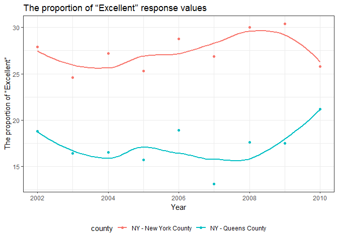

Homework 2
================

Problem 1
---------

Read and clean the data:

``` r
subway_data = 
  read_csv("./data/NYC_Transit_Subway_Entrance_And_Exit_Data.csv") %>% 
  janitor::clean_names() %>%
  select(line:entry, vending, ada) %>% 
  mutate(entry = recode(entry, "YES" = TRUE, "NO" = FALSE))
```

    ## Parsed with column specification:
    ## cols(
    ##   .default = col_character(),
    ##   `Station Latitude` = col_double(),
    ##   `Station Longitude` = col_double(),
    ##   Route8 = col_integer(),
    ##   Route9 = col_integer(),
    ##   Route10 = col_integer(),
    ##   Route11 = col_integer(),
    ##   ADA = col_logical(),
    ##   `Free Crossover` = col_logical(),
    ##   `Entrance Latitude` = col_double(),
    ##   `Entrance Longitude` = col_double()
    ## )

    ## See spec(...) for full column specifications.

``` r
subway_data
```

    ## # A tibble: 1,868 x 19
    ##    line  station_name station_latitude station_longitu~ route1 route2
    ##    <chr> <chr>                   <dbl>            <dbl> <chr>  <chr> 
    ##  1 4 Av~ 25th St                  40.7            -74.0 R      <NA>  
    ##  2 4 Av~ 25th St                  40.7            -74.0 R      <NA>  
    ##  3 4 Av~ 36th St                  40.7            -74.0 N      R     
    ##  4 4 Av~ 36th St                  40.7            -74.0 N      R     
    ##  5 4 Av~ 36th St                  40.7            -74.0 N      R     
    ##  6 4 Av~ 45th St                  40.6            -74.0 R      <NA>  
    ##  7 4 Av~ 45th St                  40.6            -74.0 R      <NA>  
    ##  8 4 Av~ 45th St                  40.6            -74.0 R      <NA>  
    ##  9 4 Av~ 45th St                  40.6            -74.0 R      <NA>  
    ## 10 4 Av~ 53rd St                  40.6            -74.0 R      <NA>  
    ## # ... with 1,858 more rows, and 13 more variables: route3 <chr>,
    ## #   route4 <chr>, route5 <chr>, route6 <chr>, route7 <chr>, route8 <int>,
    ## #   route9 <int>, route10 <int>, route11 <int>, entrance_type <chr>,
    ## #   entry <lgl>, vending <chr>, ada <lgl>

The dataset contains line, station name, station latitude and longitude, routes served, entry, vending, entrance type and ADA compliance. My data cleaning steps so far include: load the data and clean up the column names, select columns that I want to keep, and convert the entry variable from character to a logical variable. The dimension (rows x columns) of the resulting dataset is 1868, 19. These data are not tidy: the route number is spread across 11 columns.

Answer the following questions using these data:

``` r
distinct_data = distinct(subway_data, line, station_name, .keep_all = TRUE)
```

How many distinct stations are there?

There are 465 distinct stations.

How many stations are ADA compliant?

There are 84 stations are ADA compliant.

What proportion of station entrances / exits without vending allow entrance?

The proportion of station entrances / exits without vending allow entrance is 0.3770492

Reformat data so that route number and route name are distinct variables.

``` r
distinct_tidy = gather(distinct_data, key = route_number, value = route_name, 
                       route1:route11, na.rm = TRUE)
distinct_tidy
```

    ## # A tibble: 979 x 10
    ##    line  station_name station_latitude station_longitu~ entrance_type entry
    ##  * <chr> <chr>                   <dbl>            <dbl> <chr>         <lgl>
    ##  1 4 Av~ 25th St                  40.7            -74.0 Stair         TRUE 
    ##  2 4 Av~ 36th St                  40.7            -74.0 Stair         TRUE 
    ##  3 4 Av~ 45th St                  40.6            -74.0 Stair         TRUE 
    ##  4 4 Av~ 53rd St                  40.6            -74.0 Stair         TRUE 
    ##  5 4 Av~ 59th St                  40.6            -74.0 Stair         TRUE 
    ##  6 4 Av~ 77th St                  40.6            -74.0 Stair         TRUE 
    ##  7 4 Av~ 86th St                  40.6            -74.0 Stair         TRUE 
    ##  8 4 Av~ 95th St                  40.6            -74.0 Stair         TRUE 
    ##  9 4 Av~ 9th St                   40.7            -74.0 Stair         TRUE 
    ## 10 4 Av~ Atlantic Av~             40.7            -74.0 Elevator      TRUE 
    ## # ... with 969 more rows, and 4 more variables: vending <chr>, ada <lgl>,
    ## #   route_number <chr>, route_name <chr>

How many distinct stations serve the A train? Of the stations that serve the A train, how many are ADA compliant?

60 distinct stations serve the A train.

Of the stations that serve the A train, 17 are ADA compliant.

Problem 2
---------

Read and clean the Mr.Trash Wheel sheet:

``` r
library(readxl)
library(cellranger)
mr_trash_data = 
  read_excel("./data/HealthyHarborWaterWheelTotals2017-9-26.xlsx", sheet = 1,
             range = cell_cols("A:N")) %>% 
  janitor::clean_names() %>%  
  filter(!is.na(dumpster), month != "Grand Total") %>% 
  mutate(sports_balls = round(sports_balls), 
         sports_balls = as.integer(sports_balls))
mr_trash_data
```

    ## # A tibble: 215 x 14
    ##    dumpster month  year date                weight_tons volume_cubic_ya~
    ##       <dbl> <chr> <dbl> <dttm>                    <dbl>            <dbl>
    ##  1        1 May    2014 2014-05-16 00:00:00        4.31               18
    ##  2        2 May    2014 2014-05-16 00:00:00        2.74               13
    ##  3        3 May    2014 2014-05-16 00:00:00        3.45               15
    ##  4        4 May    2014 2014-05-17 00:00:00        3.1                15
    ##  5        5 May    2014 2014-05-17 00:00:00        4.06               18
    ##  6        6 May    2014 2014-05-20 00:00:00        2.71               13
    ##  7        7 May    2014 2014-05-21 00:00:00        1.91                8
    ##  8        8 May    2014 2014-05-28 00:00:00        3.7                16
    ##  9        9 June   2014 2014-06-05 00:00:00        2.52               14
    ## 10       10 June   2014 2014-06-11 00:00:00        3.76               18
    ## # ... with 205 more rows, and 8 more variables: plastic_bottles <dbl>,
    ## #   polystyrene <dbl>, cigarette_butts <dbl>, glass_bottles <dbl>,
    ## #   grocery_bags <dbl>, chip_bags <dbl>, sports_balls <int>,
    ## #   homes_powered <dbl>

Read and clean precipitation data for 2016 and 2017:

``` r
precipitation_2016 =
  read_excel("./data/HealthyHarborWaterWheelTotals2017-9-26.xlsx", sheet = 4,
             range = "A2:B14") %>% 
  janitor::clean_names() %>% 
  filter(!is.na(total)) %>% 
  mutate(year = "2016")
precipitation_2016
```

    ## # A tibble: 12 x 3
    ##    month total year 
    ##    <dbl> <dbl> <chr>
    ##  1     1  3.23 2016 
    ##  2     2  5.32 2016 
    ##  3     3  2.24 2016 
    ##  4     4  1.78 2016 
    ##  5     5  5.19 2016 
    ##  6     6  3.2  2016 
    ##  7     7  6.09 2016 
    ##  8     8  3.96 2016 
    ##  9     9  4.53 2016 
    ## 10    10  0.62 2016 
    ## 11    11  1.47 2016 
    ## 12    12  2.32 2016

``` r
precipitation_2017 =
  read_excel("./data/HealthyHarborWaterWheelTotals2017-9-26.xlsx", sheet = 3,
             range = "A2:B14") %>% 
  janitor::clean_names() %>% 
  filter(!is.na(total)) %>% 
  mutate(year = "2017")
precipitation_2017
```

    ## # A tibble: 8 x 3
    ##   month total year 
    ##   <dbl> <dbl> <chr>
    ## 1     1  2.34 2017 
    ## 2     2  1.46 2017 
    ## 3     3  3.57 2017 
    ## 4     4  3.99 2017 
    ## 5     5  5.64 2017 
    ## 6     6  1.4  2017 
    ## 7     7  7.09 2017 
    ## 8     8  4.44 2017

Combine datasets and convert month to a character variable:

``` r
precipitation_data = 
  bind_rows(precipitation_2016, precipitation_2017) %>% 
  mutate(month = month.name[month])
precipitation_data
```

    ## # A tibble: 20 x 3
    ##    month     total year 
    ##    <chr>     <dbl> <chr>
    ##  1 January    3.23 2016 
    ##  2 February   5.32 2016 
    ##  3 March      2.24 2016 
    ##  4 April      1.78 2016 
    ##  5 May        5.19 2016 
    ##  6 June       3.2  2016 
    ##  7 July       6.09 2016 
    ##  8 August     3.96 2016 
    ##  9 September  4.53 2016 
    ## 10 October    0.62 2016 
    ## 11 November   1.47 2016 
    ## 12 December   2.32 2016 
    ## 13 January    2.34 2017 
    ## 14 February   1.46 2017 
    ## 15 March      3.57 2017 
    ## 16 April      3.99 2017 
    ## 17 May        5.64 2017 
    ## 18 June       1.4  2017 
    ## 19 July       7.09 2017 
    ## 20 August     4.44 2017

The number of observations in "mr\_trash\_data" is 215. The number of observations in "precipitation\_data" is 20.

Examples of key variables: The key variable in "mr\_trash\_data" is dempster. The key variable in "precipitation\_data" is total.

The total precipitation in 2017 is 29.93. The median number of sports balls in a dumpster in 2016 is 26.

Problem 3
---------

load the data from the p8105.datasets package:

``` r
devtools::install_github("p8105/p8105.datasets")
```

    ## Skipping install of 'p8105.datasets' from a github remote, the SHA1 (21f5ad1c) has not changed since last install.
    ##   Use `force = TRUE` to force installation

``` r
library(p8105.datasets)
data(brfss_smart2010)
```

clean the data:

``` r
brfss_data = 
  brfss_smart2010 %>% 
  janitor::clean_names() %>% 
  filter(topic == "Overall Health") %>% 
  select(-class, -topic, -question, -sample_size, 
         -(confidence_limit_low:geo_location)) %>% 
  spread(key = response, value = data_value) %>% 
  janitor::clean_names() %>% 
  select(year, locationabbr, locationdesc, excellent, very_good, good, fair, poor) %>% 
  mutate(prop_exc_vg = excellent + very_good)
brfss_data
```

    ## # A tibble: 2,125 x 9
    ##     year locationabbr locationdesc excellent very_good  good  fair  poor
    ##    <int> <chr>        <chr>            <dbl>     <dbl> <dbl> <dbl> <dbl>
    ##  1  2002 AK           AK - Anchor~      27.9      33.7  23.8   8.6   5.9
    ##  2  2002 AL           AL - Jeffer~      18.5      30.9  32.7  12.1   5.9
    ##  3  2002 AR           AR - Pulask~      24.1      29.3  29.9  12.5   4.2
    ##  4  2002 AZ           AZ - Marico~      21.6      36.6  26.9  10.3   4.6
    ##  5  2002 AZ           AZ - Pima C~      26.6      30.1  31.9   7.5   3.9
    ##  6  2002 CA           CA - Los An~      22.7      29.8  28.7  14.3   4.5
    ##  7  2002 CO           CO - Adams ~      21.2      31.2  29    14.4   4.2
    ##  8  2002 CO           CO - Arapah~      25.5      35.2  29.3   8     2.1
    ##  9  2002 CO           CO - Denver~      22.2      27.1  36.6  11.1   3  
    ## 10  2002 CO           CO - Jeffer~      23.4      36.6  26.3  11.4   2.4
    ## # ... with 2,115 more rows, and 1 more variable: prop_exc_vg <dbl>

1）How many unique locations are included in the dataset? Is every state represented? What state is observed the most?

``` r
unique_location = distinct(brfss_data, locationdesc, .keep_all = TRUE) 
state_frequency = count(brfss_data, locationabbr) %>% 
  arrange(desc(n))
state_frequency
```

    ## # A tibble: 51 x 2
    ##    locationabbr     n
    ##    <chr>        <int>
    ##  1 NJ             146
    ##  2 FL             122
    ##  3 NC             115
    ##  4 WA              97
    ##  5 MD              90
    ##  6 MA              79
    ##  7 TX              71
    ##  8 NY              65
    ##  9 SC              63
    ## 10 CO              59
    ## # ... with 41 more rows

404 unique locations are included in the dataset. From state\_frequency, we can see every state is represented. NJ is observed the most.

2）In 2002, what is the median of the “Excellent” response value?

In 2002, the median of the "Excellent" response value is 23.6

3）Make a histogram of “Excellent” response values in the year 2002:

``` r
ggplot(filter(brfss_data, year == 2002), aes(x = excellent)) + 
  geom_histogram() +
    labs(
      title = "Histogram of “Excellent” response values",
      x = " “Excellent” response values",
      y = "Frequency"
    ) + 
    theme_bw()
```

    ## `stat_bin()` using `bins = 30`. Pick better value with `binwidth`.

    ## Warning: Removed 2 rows containing non-finite values (stat_bin).


4）Make a scatterplot showing the proportion of “Excellent” response values in New York County and Queens County (both in NY State) in each year from 2002 to 2010:

``` r
brfss_data %>% 
  filter(locationdesc %in% c("NY - New York County", "NY - Queens County")) %>% 
  ggplot(aes(x = year, y = excellent, color = locationdesc)) + 
    geom_point() +
    geom_smooth(se = FALSE) +
    labs(
      title = "The proportion of “Excellent” response values",
      x = "Year",
      y = "The proportion of “Excellent”"
    ) + 
    theme_bw() + 
    theme(legend.position = "bottom")
```

    ## `geom_smooth()` using method = 'loess' and formula 'y ~ x'


